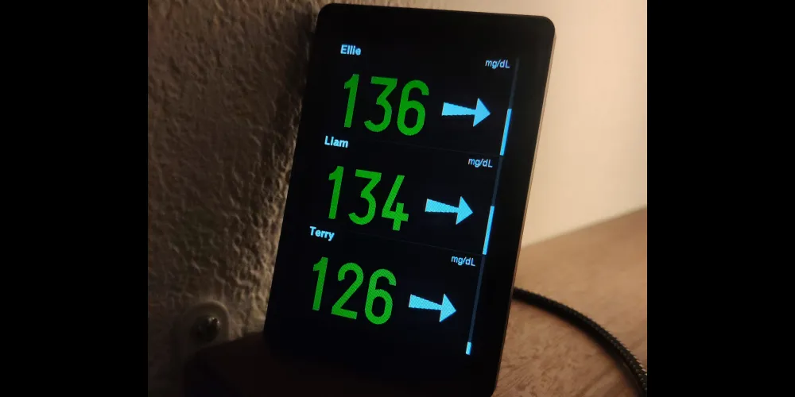

# Gluco-Family (DIY)

Gluco-Family is an open-source, low-cost device that displays the real-time glucose data of **several family members on a single always-visible screen**.

It is a **fork of [Gluco-Monitor](#) by F1ATB** <!-- TODO: add the Gluco-Monitor link here -->, adapted for households with multiple people living with type 1 diabetes. Where the original shows **one** person's glucose, Gluco-Family shows **up to 3 people at once** — so you can check everyone at a glance from the kitchen or living room, without juggling several phones.

The MVP targets **Dexcom** sensors for all members; **mixed Dexcom + FreeStyle Libre** support is planned (see roadmap in `PRD.md`).

---

## 🚀 Features

* 📊 Real-time glucose display for **3 people on one screen**
* 📈 Trend indication per person (rising, falling, stable)
* ⏱️ Freshness indicator per person (visual alert when a reading gets too old)
* 📡 Wireless data retrieval via the **Dexcom Share** API (one account per person)
* 🧩 Resilient: a failure on one person's sensor doesn't interrupt the others
* 🖐️ Full on-device configuration via the touchscreen
* 🌍 Multilingual interface (FR, EN, DE, ES, IT)
* 🔧 Fully DIY and open-source
* 💰 Low cost (~$25 per screen — deploy as many as you like around the house)

---

## 🧠 How It Works

Modern CGM systems like Dexcom continuously measure glucose levels and push the data to each person's smartphone, which relays it to the **Dexcom cloud**.

Gluco-Family connects to this ecosystem by retrieving each family member's glucose data from the Dexcom Share API and displaying all of them on a single dedicated screen.

This allows a parent or caregiver to:

* See everyone's glucose instantly without unlocking any phone
* Spot at a glance who is going high or low (value + trend arrow)
* Monitor family members even when they're away (data flows through the cloud, as long as their phone has signal and the screen has Wi-Fi)
* Run **several screens** around the house — each one is autonomous, no master/slave setup

---

## 🛠️ Hardware

This project targets a specific all-in-one board (same as the upstream project):

* **ESP32-S3 Smart Display** with an **AXS15231B 320×480 capacitive touchscreen**
* 16 MB flash + PSRAM
* Built-in Wi-Fi
* USB for flashing and power

👉 Total cost is typically around **$25** per unit.

---

## 💻 Software

The firmware is developed using:

* C++ with the **Arduino framework**, built via **PlatformIO**
* `pioarduino/platform-espressif32` platform (the legacy `espressif32` platform does **not** compile this project)
* Wi-Fi connectivity for data access
* Lightweight graphical interface (Arduino_GFX) with on-screen touch configuration

---

## 📦 Installation

1. Clone this repository:

```bash
git clone https://github.com/your-username/gluco-family.git
```

2. Open the project with PlatformIO

3. Build and upload to your ESP32-S3 device:

```bash
pio run -t upload
```

4. On first boot, configure via the touchscreen:
   * Wi-Fi network
   * Each person (name + Dexcom credentials)
   * Dexcom region (US / Non-US / JP)

> ⚠️ **Note on credentials:** Dexcom usernames and passwords are stored in clear text in `parametres.json` on the device's flash (LittleFS), as in the upstream project. The flash is not network-accessible, but be aware of this if you reuse the hardware.

---

## 🔗 Documentation & Build Guide

🚧 **Coming soon.**

A full step-by-step guide (hardware assembly, wiring, firmware setup, configuration) is planned. In the meantime, see `PRD.md` for the design and roadmap.

---

## ⚠️ Disclaimer

This project is **not a medical device** and must not be used for medical decisions.

Always rely on official CGM devices and medical advice for diabetes management.

---

## 🤝 Contributing

Contributions are welcome!

Feel free to:

* Open issues
* Suggest improvements
* Submit pull requests

---

## 📄 License

This project is open-source. See the LICENSE file for details.

---

## ❤️ Acknowledgments

* **[Gluco-Monitor](#) by F1ATB** — the original project this fork is based on <!-- TODO: add the Gluco-Monitor link here -->
* CGM community and open-source contributors
* Projects like xDrip+ and Nightscout
* Developers working on diabetes technology

---

## ⭐ Support the Project

If you like this project:

* ⭐ Star the repository
* Share it with others
* Build your own and contribute improvements!
